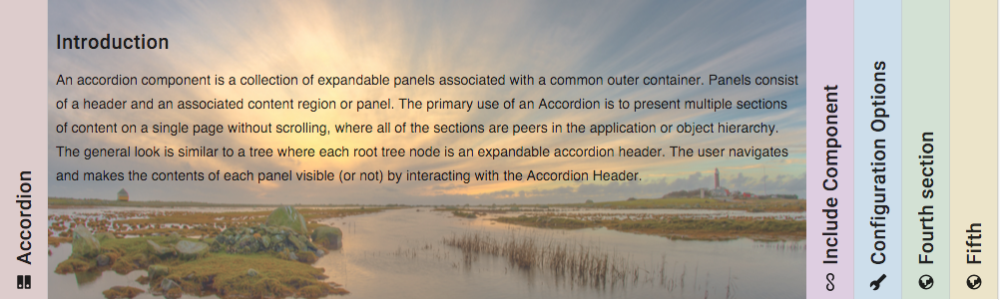
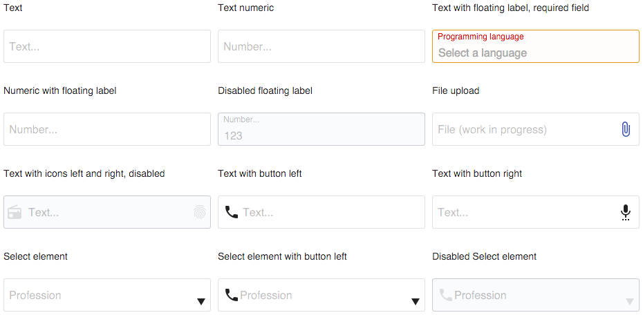
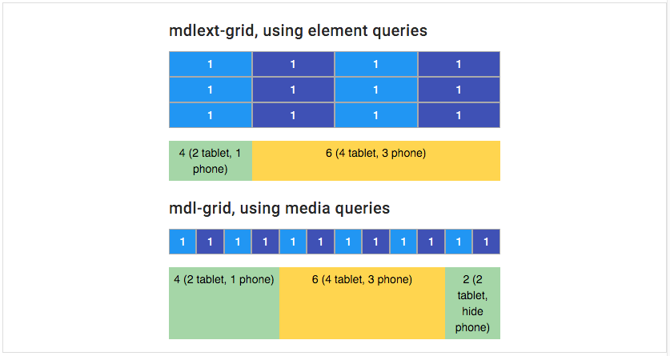
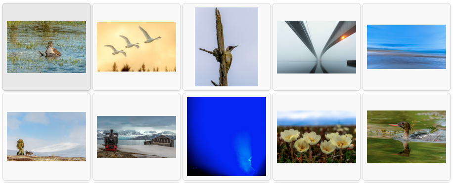

# mdl-ext

[](https://travis-ci.org/leifoolsen/mdl-ext)
[](https://codecov.io/github/leifoolsen/mdl-ext)
[](https://github.com/semantic-release/semantic-release)
[](http://npm.im/mdl-ext)

Material Design Lite Ext (MDLEXT).
Components built with the [Google Material Design Lite](https://github.com/google/material-design-lite) framework. MDLEXT provides the following components.

* **Accordion**<br/>A WAI-ARIA friendly accordion component with vertcial or horizontal layout.
* **Bordered fields**<br/> The Material Design Lite Ext (MDLEXT) bordered fields component demonstrates how you can create your own theme of MDL text fields.
* **Grid**<br/> A responsive grid based on element queries in favour of media queries.
* **Lightboard**<br/>A lightboard is a translucent surface illuminated from behind, used for situations where a shape laid upon the surface needs to be seen with high contrast. In the "old days" of photography photograpers used a lightboard to get a quick view of, sorting and organizing their slides.
* **Lightbox**<br/>A lightbox displays an image filling the screen, and dimming out the rest of the web page. It acts as a modal dialog using the `<dialog>` element as a container for the lightbox.
* **Selectfield**<br/>The Material Design Lite Ext (MDLEXT) select field component is an enhanced version of the standard HTML `<select>` element.

#### Live demo
A Live demo of MDLEXT is available [here](http://leifoolsen.github.io/mdl-ext/index.html)
>Works with modern browsers.
>Tested on Edgde, IE11. Firefox: OSX, Ubuntu. Opera: OSX. Safari: OSX, IOS. Chrome: Win, Ubuntu, OSX, IOS. 

## Introduction
The MDLEXT component library is built with responsiveness in mind. The pre built CSS provided in the lib directory therefore comes
in two versions; one based on media queries and one based on **element queries**, using [eq.js](https://github.com/Snugug/eq.js).
If you build the CSS from SASS, just import the correct sass file, `mdl-ext.scss` or `mdl-ext-eqjs.scss`.

### Responsive breakpoints
A common metod in responsive design is to use media queries to apply styles based on device
characteristics. The problem with media queries is that they relates to the viewport - so every time you
write a media query for `max-width` or `min-width`, you’re connecting the appearance of your module to the
width of the entire canvas, not the part of the canvas the component occupies.

#### Media queries are a hack
Some developers claim that [media queries are a hack](http://ianstormtaylor.com/media-queries-are-a-hack/),
and I totally agree! Imagine a design with a sidebar and a content area. In a responsive,
fluent design both the sidebar and the content has "unknown" widths. Trying to add e.g. a responsive grid into the content
area which relies on media queries, where you have no knowledge of how much space your content occupies, is
in my opinion almost an impossible task.

#### Element queries to the rescue
An element query is similar to a media query in that, if a condition is met, some CSS will be applied.
Element query conditions (such as `min-width`, `max-width`, `min-height` and `max-height`) are based on elements,
instead of the browser viewport. Unfortunately, CSS doesn’t yet support element queries, but there are a
couple of JavaScript-based polyfrills involving various syntaxes. **They are not standard - but that
should not stop us from using them.** Element-first design is the spirit of the Atomic design principle, but
looks very different in practice than how most people implement Atomic design using their mobile-first mindset.
Instead of writing styles on advance for every conceivable situation a widget may find itself in, we are able
to allow individual parts of the layout to adapt responsively when those elements require it.

Some of the polyfrills available are:
* [eq.js](https://github.com/Snugug/eq.js)
* [EQCSS](https://github.com/eqcss/eqcss)
* [CSS Element Queries](https://github.com/marcj/css-element-queries)
* [BoomQueries](https://github.com/BoomTownROI/boomqueries)

These are all good libraries, and they serve the purpose. After some evaluation I decided to go for
[**eq.js**](https://github.com/Snugug/eq.js). It is a small library with support for width based breakpoints.
It works without requiring a server to run (no Ajax stuff). It does not break the existing CSS standard.
I can use SASS for styling, and it works well in a Webpack workflow.

## Install
If you haven't done so already, install [Material Design Lite](https://github.com/google/material-design-lite).

```sh
$ npm install --save material-design-lite
```

Install **mdl-ext**
```sh
$ npm install --save mdl-ext
```

Install **eq.js** if you choose to use the element query CSS/SASS version.
```sh
$ npm install --save eq.js
```

## Getting started

### Use it in your (static) page
```html
<!DOCTYPE html>
<html>
<head>
  <title>Material Design Lite Extensions</title>
  <link rel="stylesheet" href="https://fonts.googleapis.com/css?family=Roboto:regular,bold,italic,thin,light,bolditalic,black,medium&amp;lang=en">
  <link rel="stylesheet" href="https://fonts.googleapis.com/icon?family=Material+Icons">
  <link rel="stylesheet" href="node_modules/material-design-lite/material.css" />
  <link rel="stylesheet" href="node_modules/mdl-ext/lib/mdl-ext.min.css" />
</head>
<body>
<div class="mdl-layout mdl-js-layout mdl-layout--fixed-drawer">
  <main class="mdl-layout__content">
  </main>
</div>
<script type="text/javascript" src="node_modules/material-design-lite/material.min.js" charset="utf-8"></script>
<script type="text/javascript" src="node_modules/mdl-ext/lib/index.min.js" charset="utf-8"></script>
</body>
</html>
```

### Use it with element queries in your (static) page
```html
<!DOCTYPE html>
<html>
<head>
  <title>Material Design Lite Extensions</title>
  <link rel="stylesheet" href="https://fonts.googleapis.com/css?family=Roboto:regular,bold,italic,thin,light,bolditalic,black,medium&amp;lang=en">
  <link rel="stylesheet" href="https://fonts.googleapis.com/icon?family=Material+Icons">
  <link rel="stylesheet" href="node_modules/material-design-lite/material.css" />
  <link rel="stylesheet" href="node_modules/mdl-ext/lib/mdl-ext-eqjs.min.css" />
</head>
<body>
<div class="mdl-layout mdl-js-layout mdl-layout--fixed-drawer">
  <main class="mdl-layout__content">
  </main>
</div>
<script type="text/javascript" src="node_modules/material-design-lite/material.min.js" charset="utf-8"></script>
<script type="text/javascript" src="node_modules/mdl-ext/lib/index.min.js" charset="utf-8"></script>
<script type="text/javascript" src="node_modules/eq.js/dist/eq.min.js" charset="utf-8"></script>
</body>
</html>
```

>**Note:** Always import `mdl-ext` css **after** `material` css. Adjust path to `node_modules` (libraries) according to where your HTML file is located.

### Use it in your (Webpack) build

**Import SASS files**

```scss
@charset "UTF-8";

// 1. Import MDL
@import '../node_modules/material-design-icons/iconfont/material-icons.css';
@import '../node_modules/roboto-fontface/css/roboto-fontface.css';
@import '../node_modules/material-design-lite/src/material-design-lite';

// 2. Import MDLEXT
@import '../node_modules/mdl-ext/src/mdl-ext';

// 2. ... or import mdl-ext-eqjs
//@import '../node_modules/mdl-ext/src/mdl-ext-eqjs';

// 3. Your stuff
@import 'stylesheets/variables';
@import 'stylesheets/app/whatever';
```
>Imports above assumes that your main SASS file is located in the `./src` folder. Adjust path to `node_modules` according to where your SASS file is located.

**Import material-design-lite and mdl-ext scripts in your js file**
```javascript
import 'material-design-lite/material';
import 'mdl-ext';
```

**... or require material-design-lite and mdl-ext**
```javascript
require('material-design-lite/material');
require('mdl-ext');
```

**If you choose to use element queries, import or require `eq.js`**  
```javascript
import eqjs from 'eq.js';  // ... or:  const eqjs = require('eq.js');
```

## Components

### Accordion


A [WAI-ARIA](https://www.w3.org/TR/wai-aria-practices-1.1/#accordion) friendly [**accordion**](./src/accordion/) component with vertcial or horizontal layout.

### Bordered fields


The Material Design Lite Ext (MDLEXT) [**bordered fields**](./src/bordered-fields/) component demonstrates how you can create your own theme of MDL text fields.

### Grid


A responsive [**grid**](./src/grid) based on **element queries** in favour of media queries.

### Lightboard


A [**lightboard**](./src/lightboard/) is a translucent surface illuminated from behind, used for
situations where a shape laid upon the surface needs to be seen with high contrast. In the "old days"
of photography photograpers used a lightboard to get a quick view of, sorting and organizing their slides.

### Lightbox

A [**lightbox**](./src/lightbox/) displays an image filling the screen, and dimming out the rest of the web page. It acts as a modal dialog using the `<dialog>` element as a container for the lightbox.


### Selectfield


The Material Design Lite Ext (MDLEXT) [**select field**](./src/selectfield/) component is an enhanced version
of the standard [HTML `<select>`] (https://developer.mozilla.org/en/docs/Web/HTML/Element/select) element.

## Notes
>A Live demo of MDLEXT is available [here](http://leifoolsen.github.io/mdl-ext/index.html).<br/>
>You can also download or clone a demo project from here: https://github.com/leifoolsen/mdl-webpack. The demo project demonstrates
how you can set up MDL with Babel(6) and Webpack, and how to self host Font Roboto and Material Icons in your web application.

>Polyfills you might need:
>* [dialog-polyfill](https://github.com/GoogleChrome/dialog-polyfill)
>* [eqjs](https://github.com/Snugug/eq.js)
>* [custom-event polyfill](https://github.com/webmodules/custom-event) or similar


## Licence
© Leif Olsen, 2016. Licensed under an [Apache-2](https://github.com/leifoolsen/mdl-ext/blob/master/LICENSE) license.

This software is built with the [Google Material Design Lite](https://github.com/google/material-design-lite) framework,
which is licenced under an Apache-2 licence.
