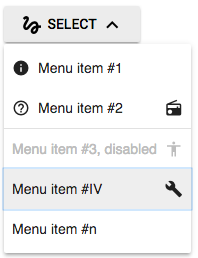

# Menu Buttom


A WAI-ARIA friendly menu button.

## Introduction
A menu button is a [button](https://www.w3.org/TR/wai-aria-practices/#button) that opens a 
[menu](https://www.w3.org/TR/wai-aria-practices/#menu). It is often styled as a typical push button with a 
downward pointing arrow or triangle to hint that activating the button will display a menu. 
The menu button has roles, attributes and behaviour as outlined in WAI-ARIA Authoring Practices.

A menu is a widget that offers a list of choices to the user, such as a set of actions or functions. A menu is (usually) 
opened, or made visible, by activating a menu button. When a user activates a choice in a menu, the menu (usually) closes.

## To include a MDLEXT **menu button** component:
TBD


### Example
TBD


### More examples
* The [snippets/menu-button.html](./snippets/menu-button.html) and the [tests](../../test/menu-button/menu-button.spec.js) provides more detailed examples.
* Try out the [live demo](http://leifoolsen.github.io/mdl-ext/demo/menu-button.html)


## Characteristics

### Keyboard interaction, Menu Button 
* With focus on the button:
    * <kbd>Space</kbd> or <kbd>Enter</kbd>: opens the menu, sets `aria-expanded="true"`, and place focus on the previously selected menu item - or on the first menu item if no selected menu item.
    * <kbd>Down Arrow</kbd>: opens the menu, sets `aria-expanded="true"`, and moves focus to the first menu item.
    * <kbd>Up Arrow</kbd>: opens the menu, sets `aria-expanded="true"`, and moves focus to the last menu item.

### Mouse interaction, Menu Button 
* With focus on the button:
    * <kbd>Click</kbd>: opens the menu, sets `aria-expanded="true"`, and place focus on the previously selected menu item - or on the first menu item if no selected menu item.
    
### Keyboard interaction, Menu
* With focus on the menu:
    * <kbd>Space</kbd> or <kbd>Enter</kbd>: sets `aria-selected="true"` on active menu item, sets `aria-expanded="true"` on menu button, closes menu and moves focus back to menu button. The button emits a custom `select` event with a referfence to the selected menu element.
    * <kbd>Home</kbd>: move focus to first menu item.
    * <kbd>End</kbd>: move focus to last menu item.
    * <kbd>Up Arrow</kbd> or <kbd>Left Arrow</kbd>: move focus to previous menu item.
    * <kbd>Down Arrow</kbd> or <kbd>Right Arrow</kbd>: Move focus to next menu item.
    * <kbd>Esc</kbd>: Closes the menu, sets `aria-expanded="true"` on menu button, and move focus back to menu button.

>The keyboard behaviors after the menu is open are described in more detail in WAI-ARIA Authoring Practices, [2.19 Menu or Menu bar](https://www.w3.org/TR/wai-aria-practices/#menu).

### Mouse interaction, Menu
* With focus on the menu:
    * <kbd>Click</kbd>: sets `aria-selected="true"` on active menu item, sets `aria-expanded="true"` on menu button, closes menu and moves focus back to menu button. The button emits a custom `select` event with a referfence to the selected menu element. 

## WAI-ARIA Roles, States, and Properties
The menu buttom has the following roles, states and properties set by the menu button component.

### Menu Button
* `role="button"`: the element that opens the menu has role [button](http://www.w3.org/TR/wai-aria-1.1/#button).
* `aria-haspopup`: the element with role `button` has [aria-haspopup](http://www.w3.org/TR/wai-aria-1.1/#aria-haspopup) set to `true`.
* `aria-controls`: identfies the content on the page (e.g. using IDREFs) that this menu button controls.
* `aria-expanded`: the element with role `button` has [aria-expanded](https://www.w3.org/TR/wai-aria-1.1/#aria-expanded) set to `true` if the corresponding menu is open, oterwise false.
* `aria-expanded`: when a menu item is disabled, `aria-disabled` is set to `true`.

### Menu, WAI-ARIA Roles
* `role="menu"`: identifies the element as a menu widget.
* `hidden`: the menu has attrubute hidden if the controlling buttoun has `aria-expanded="false"`, otherwise the attribute is not present.
* `role="menuitem"`: identifies an element as a menu item widget.
* `role="menuitemcheckbox"`: (not yet implemented).
* `role="menuitemradion"`: (not yet implemented).
* `aria-selected`: the selected menu item has `aria-selected="true"`, otherwise not present.
* `role="separator"`: a divider that separates and distinguishes sections of content or groups of menuitems..
* `disabled"`: indicates that a menu item is disabled, otherwise not present.

 
>The roles, states, and properties needed for the menu are described in more detail in WAI-ARIA Authoring Practices, [2.19 Menu or Menu bar](https://www.w3.org/TR/wai-aria-practices/#menu).


## Strategy used to position a menu when opened
When a menu is opened, the following strategy is used to position the menu next to the button.

1. menu.height > viewport.height<br/>
      let menu.height = viewport.heigt<br/>
      let menu.overflow-y = auto
2. menu.width > viewport.width<br/>
      let menu.width = viewport.width
3. position menu below button, aligned to its left<br/>
      done if menu inside viewport
4. position menu below button, aligned to its right<br/>
      done if menu inside viewport
5. position menu above button, aligned to its left<br/>
      done if menu inside viewport
6. position menu at button right hand side<br/>
      done if menu inside viewport
7. position menu at button left hand side<br/>
      done if menu inside viewport
8. position menu inside viewport
    1. position menu at viewport bottom
    2. position menu at button right hand side<br/>
       done if menu inside viewport
    3. position menu at button left hand side<br/>
       done if menu inside viewport
    4. position menu at viewport right
9. done


## Events emitted from the component
The menu button emits a custom `select` event when a menu item is selected. The event has a detail object with the following structure:

```javascript
detail: { 
  source: item // The selected menu item 
}
```

To set up an event listener to receive the select custom event.
```javascript
document.querySelector('#my-menubutton').addEventListener('select', function(e) {
  console.log('menu item selected:', e.detail.source);
});
```
Refer to [snippets/menu-button.html](./snippets/menu-button.html) or the [tests](../../test/menu-button/menu-button.spec.js) for detailed usage.


## Configuration options

The MDLEXT CSS classes apply various predefined visual and behavioral enhancements to the menu button. 
The table below lists the available classes and their effects.

| MDLEXT class                 | Effect | Remarks |
|------------------------------|--------|---------|
|`mdl-button`                  | Defines button as an MDL component | Required on button element |
|`mdl-js-button`               | Assigns basic MDL behavior to button | Required on button element |
|`mdlext-js-menu-button`       | Assigns basic MDL behavior to menu button | Required on the element that should act as a button |
|`mdlext-menu`                 | Defines an unordered list container as an MDLEXT component | Required on ul element |
|`mdlext-menu__item`           | Defines menu options | Required on list item elements |
|`mdlext-menu__item__label`    | Holds the menu text | Optional on span element inside list item element - but required if you want to decorate a menu item with icons. More than one label can be used to control warious aspects of the menu text, e.g. font size. |
|`mdlext-menu__item-separator` | Items in a menu may be divided into groups by placing an element with a role of `separator` between groups. | Optional on list item elements |
