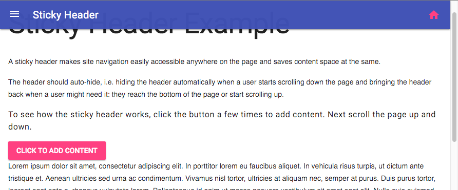

# Sticky Header



A sticky header can be used as a replacement for the Material Design Lite 
[Fixed Header](https://github.com/google/material-design-lite/tree/master/src/layout#examples).

## Introduction
A sticky header makes site navigation easily accessible anywhere on the page and saves content space at the same.

The header should auto-hide, i.e. hiding the header automatically when a user starts scrolling down the page and 
bringing the header back when a user might need it: they reach the bottom of the page or start scrolling up.

>**Note:** The Sticky Header does not collapse on smaller screens.

### To include a MDLEXT **sticky-header** component:

&nbsp;1. Code a `<div>` element. This is the "outer" div that holds the entire layout.
```html
<div>
</div>
```

&nbsp;2. Add MDL classes as indicated, separated by spaces, to the `div` using the class attribute.
```html
<div class="mdl-layout mdl-js-layout mdl-layout--fixed-drawer mdl-layout--fixed-header">
</div>
```

&nbsp;3. Inside the div, code a `<header>` element, as described in the Material Design Lite 
[Component Guide](https://getmdl.io/components/index.html#layout-section/layout). Add MDL classes as indicated.
```html
<div class="mdl-layout mdl-js-layout mdl-layout--fixed-drawer mdl-layout--fixed-header">
  <header class="mdl-layout__header mdl-layout__header--waterfall mdlext-layout__sticky-header mdlext-js-sticky-header">
    <div class="mdl-layout__header-row">
  
      <!-- Title -->
      <span id="header-title" class="mdl-layout-title">Title goes here</span>
  
      <!-- Add spacer, to align navigation to the right -->
      <div class="mdl-layout-spacer"></div>
  
      <label id="go-home" class="mdl-button mdl-js-button mdl-button--icon mdl-button--colored">
        <a href="#">
          <i class="material-icons">home</i>
        </a>
      </label>
    </div>
  </header>
</div>
```

&nbsp;4. Code a drawer, and include the MDL class as indicated
```html
<div class="mdl-layout mdl-js-layout mdl-layout--fixed-drawer mdl-layout--fixed-header">
  <header class="mdl-layout__header mdl-layout__header--waterfall mdlext-layout__sticky-header mdlext-js-sticky-header">
    <div class="mdl-layout__header-row">
  
      <!-- Title -->
      <span id="header-title" class="mdl-layout-title">Title goes here</span>
  
      <!-- Add spacer, to align navigation to the right -->
      <div class="mdl-layout-spacer"></div>
  
      <label id="go-home" class="mdl-button mdl-js-button mdl-button--icon mdl-button--colored">
        <a href="#">
          <i class="material-icons">home</i>
        </a>
      </label>
    </div>
  </header>

  <aside class="mdl-layout__drawer">
    <span class="mdl-layout-title">Drawer title</span>
    <nav class="mdl-navigation">
      <a class="mdl-navigation__link" href="#">A manu item</a>
    </nav>
  </aside>
</div>
```

&nbsp;4. Add a `<main>` element to hold the layout's primary content, and include the MDL class as indicated
```html
<div class="mdl-layout mdl-js-layout mdl-layout--fixed-drawer mdl-layout--fixed-header">
  <header class="mdl-layout__header mdl-layout__header--waterfall mdlext-layout__sticky-header mdlext-js-sticky-header">
    <div class="mdl-layout__header-row">
  
      <!-- Title -->
      <span id="header-title" class="mdl-layout-title">Title goes here</span>
  
      <!-- Add spacer, to align navigation to the right -->
      <div class="mdl-layout-spacer"></div>
  
      <label id="go-home" class="mdl-button mdl-js-button mdl-button--icon mdl-button--colored">
        <a href="#">
          <i class="material-icons">home</i>
        </a>
      </label>
    </div>
  </header>

  <aside class="mdl-layout__drawer">
    <span class="mdl-layout-title">Drawer title</span>
    <nav class="mdl-navigation">
      <a class="mdl-navigation__link" href="#">A manu item</a>
    </nav>
  </aside>
  
  <main class="mdl-layout__content">
    <p>Content</p>
    <p>Goes</p>
    <p>Here</p>
  </main>  
</div>
```

### Example
See [the live demo](http://leifoolsen.github.io/mdl-ext/demo/sticky-header.html)


## Configuration options

The MDLEXT CSS classes apply various predefined visual and behavioral enhancements to the lightbox.
The table below lists the available classes and their effects.

| MDLEXT class | Effect | Remarks |
|--------------|--------|---------|
| `mdlext-layout__sticky-header` | Defines a header as an MDLEXT header component | Required on `<header>` element |
| `mdlext-js-sticky-header` | Assigns basic MDL behavior to header | Required on `<header>` element |


You can modify the sticky-header trough the following SASS variables.

| SASS variable  | Value |
|----------------|-------|
| `$mdlext-sticky-header-background-color`            | transparent |
| `$mdlext-sticky-header-background-color-scroll`     | transparent |
| `$mdlext-sticky-header-gradient-color`              | $color-primary !default |
| `$mdlext-sticky-header-gradient-color-start`        | unquote("rgb(#{$mdlext-sticky-header-gradient-color})") |
| `$mdlext-sticky-header-gradient-color-end`          | $mdlext-sticky-header-gradient-color-start |
| `$mdlext-sticky-header-gradient-color-scroll-start` | unquote("rgba(#{$mdlext-sticky-header-gradient-color}, 0.98)") |
| `$mdlext-sticky-header-gradient-color-scroll-end`   | unquote("rgba(#{$mdlext-sticky-header-gradient-color}, 0.95)") |
| // Background shorthand                             | |
| `$mdlext-sticky-header-background`                  | `$mdlext-sticky-header-background-color linear-gradient(to bottom, $mdlext-sticky-header-gradient-color-start 0, $mdlext-sticky-header-gradient-color-end 100%)` |
| // Background shorthand when content is scrolling   | |
| `$mdlext-sticky-header-background-scroll`           | `$mdlext-sticky-header-background-color-scroll linear-gradient(to bottom, $mdlext-sticky-header-gradient-color-scroll-start 100%, $mdlext-sticky-header-gradient-color-scroll-end 100%)`|

>**Note:** Only the shorthand variables, `$mdlext-sticky-header-background` and `$mdlext-sticky-header-background-scroll`, 
are used in the [SASS file](./_sticky-header.scss). The other variables are only helpers.

## How to use the component programmatically
The [tests](../../test/sticky-header/sticky-header.spec.js) provides example code on how to use the component programmatically.

